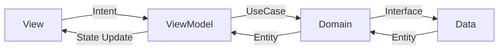

# 프로젝트 아키텍처 가이드 (Architecture Guide)

이 프로젝트는 **Feature-First** 구조와 **Clean Architecture** 계층 분리, 그리고 **MVI (Model-View-Intent)** 상태 관리 패턴을 결합하여 가독성과 유지보수성을 극대화합니다.

## 1. 디렉토리 구조 (Feature-First)

모든 코드는 기능(Feature) 단위로 그룹화됩니다. 각 기능 폴더는 독립적으로 실행 가능한 클린 아키텍처 계층을 가집니다.

```text
lib/
├── core/                # 공통 유틸리티, 테마, 데이터 모델 (shared)
├── features/            # 기능 단위 폴더
│   └── [feature_name]/  # 예: now, history, us, plan
│       ├── domain/      # 비즈니스 로직 (순수 Dart)
│       │   ├── entities/
│       │   └── usecases/
│       ├── data/        # 데이터 소스 및 Repository 구현
│       │   ├── datasources/
│       │   └── repositories/
│       └── presentation/ # UI 및 상태 관리 (MVI)
│           ├── screens/
│           ├── widgets/
│           ├── viewmodel.dart
│           ├── state.dart
│           └── intent.dart
└── main.dart
```

## 2. 계층별 역할

### Domain Layer (핵심 비즈니스 로직)
- 외부 라이브러리(Flutter, Firebase 등)에 의존하지 않는 순수 Dart 코드로 작성됩니다.
- **Entities**: 앱 전반에서 사용되는 핵심 도메인 모델.
- **Use Cases**: 사용자가 행하는 구체적인 행동(비즈니스 로직 단위).

### Data Layer (데이터 통신)
- Domain Layer의 Repository 인터페이스를 실제로 구현합니다.
- **Data Sources**: API 통신(Retrofit, Firebase)이나 로컬 DB 연동을 담당합니다.
- **Mappers**: API 응답(DTO)을 UI에서 사용하기 편한 Entity로 변환합니다.

### Presentation Layer (MVI 패턴 적용)
- 사용자에게 화면을 보여주고 상호작용을 처리합니다.
- **State**: UI가 표현해야 하는 데이터의 단일 소스 (Immutable). `Freezed`를 사용합니다.
- **Intent**: 사용자의 액션(버튼 클릭, 새로고침 등)을 정의합니다.
- **ViewModel**: 
  - `AsyncNotifier` (Riverpod)를 사용하여 상태를 관리합니다.
  - 사용자의 `Intent`를 받아 `UseCase`를 실행하고 결과를 `State`에 반영합니다.
- **Screen**: ViewModel의 `State`를 관찰(Ref.watch)하여 UI를 렌더링하고, 사용자 액션을 `Intent` 형태로 ViewModel에 전달(dispatch)합니다.

## 3. MVI 데이터 흐름



1. **Intent**: 사용자가 버튼을 클릭하면 `ViewModel.dispatch(Intent)`를 호출합니다.
2. **Action**: ViewModel은 필요한 `UseCase`를 호출합니다.
3. **State Change**: `UseCase` 결과에 따라 ViewModel은 새로운 Immutable한 `State`를 생성하여 UI에 알립니다.
4. **Render**: UI는 바뀐 `State`에 맞춰 화면을 다시 그립니다.

---

## 4. 아키텍처 원칙
- **의존성 규칙**: 의존성은 항상 안쪽(Domain)으로만 향해야 합니다.
- **단일 상태**: 화면 하나당 하나의 State 클래스만 가집니다.
- **불변성**: 모든 상태와 엔티티는 Immutable하게 정의하며, 상태 변경은 오직 `copywith` 등을 통한 새 인스턴스 생성으로만 수행합니다.
